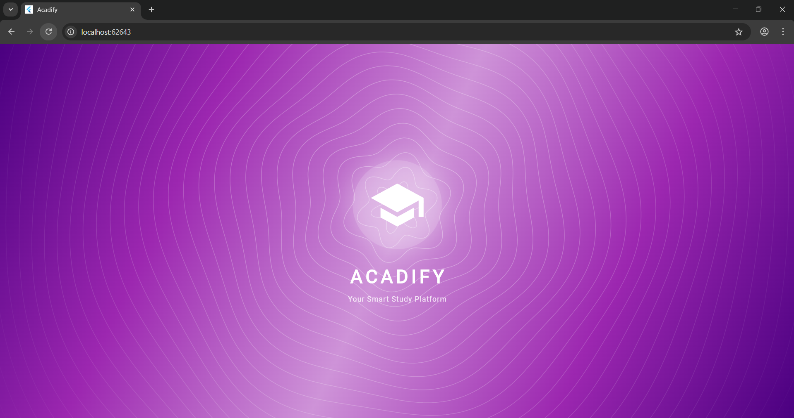
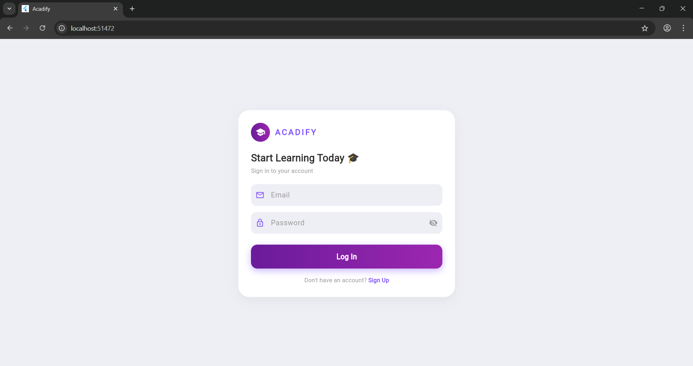
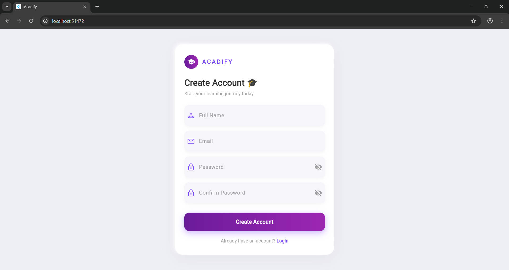
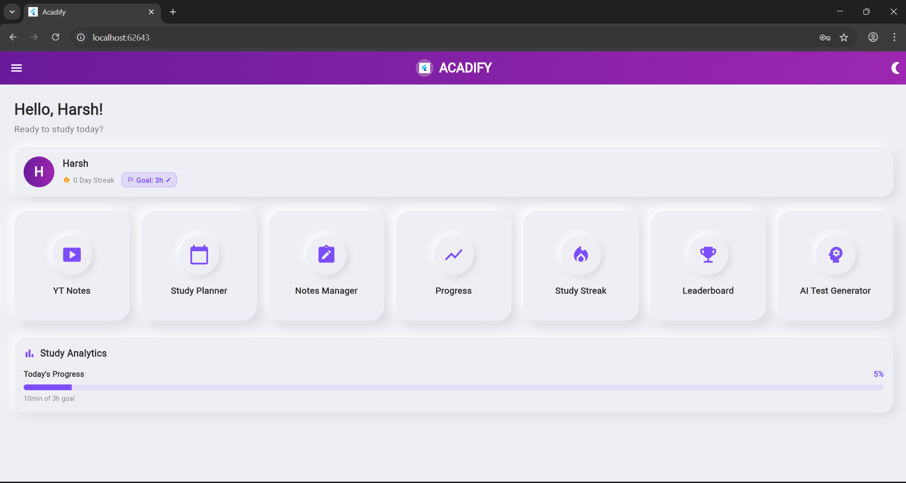
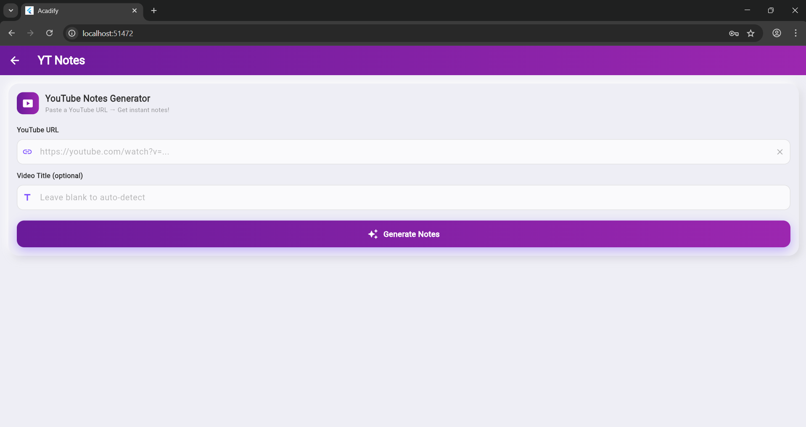
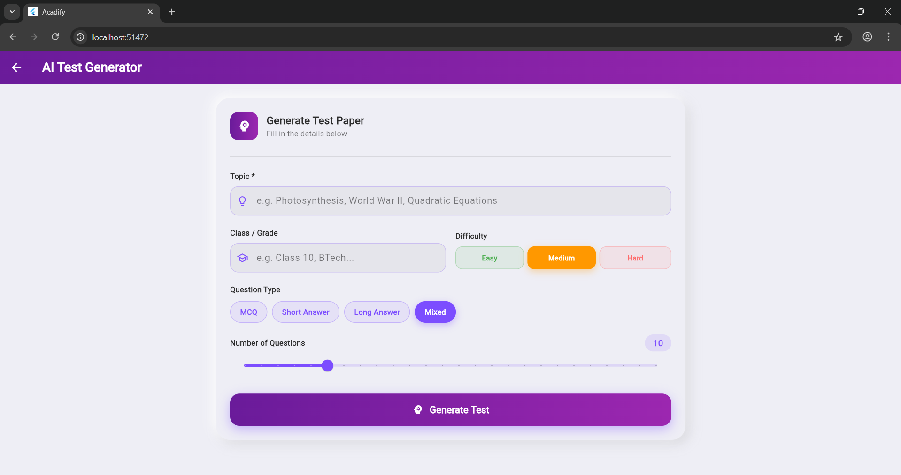
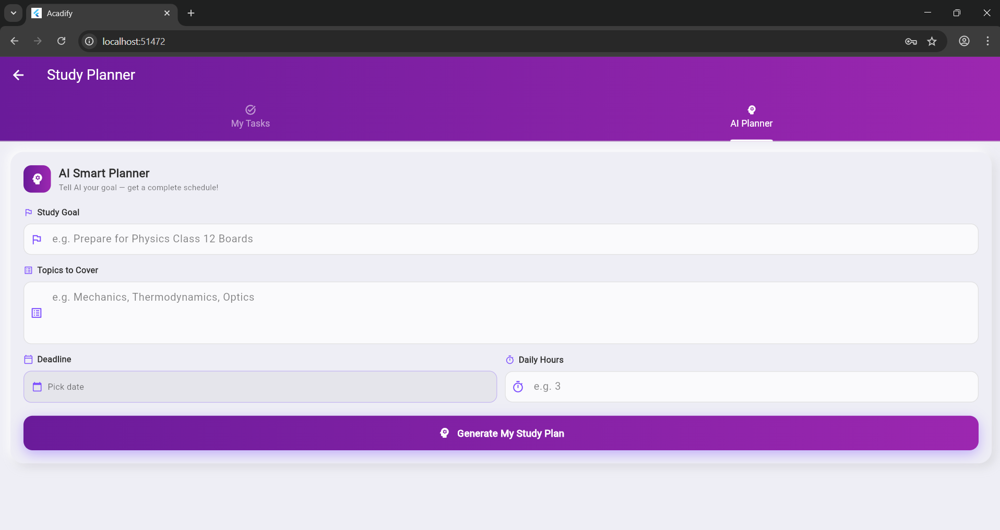
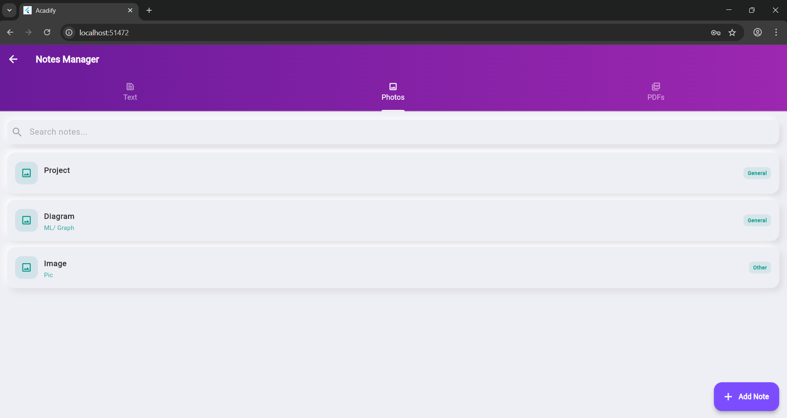
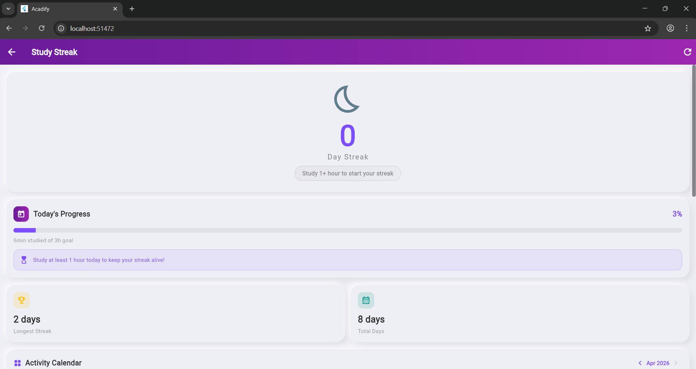
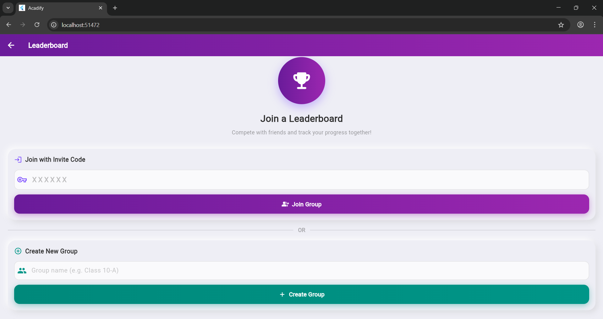

<div align="center">

```
 █████╗  ██████╗ █████╗ ██████╗ ██╗███████╗██╗   ██╗
██╔══██╗██╔════╝██╔══██╗██╔══██╗██║██╔════╝╚██╗ ██╔╝
███████║██║     ███████║██║  ██║██║█████╗   ╚████╔╝ 
██╔══██║██║     ██╔══██║██║  ██║██║██╔══╝    ╚██╔╝  
██║  ██║╚██████╗██║  ██║██████╔╝██║██║        ██║   
╚═╝  ╚═╝ ╚═════╝╚═╝  ╚═╝╚═════╝ ╚═╝╚═╝        ╚═╝  
```

**AI-Powered Student Study Platform**

*Turn any lecture, topic, or deadline into a complete study system — in seconds.*

<br>

[](https://flutter.dev)
[](https://dart.dev)
[](https://firebase.google.com)
[](https://groq.com)
[](LICENSE)
[](https://acadify-f6372.web.app)

</div>

---

## What is Acadify?

Students already spend hours on YouTube, scattered paper notes, and generic to-do apps. Acadify replaces all of that with a single intelligent companion that understands how studying actually works.

Built as a B.Tech final year project, Acadify connects AI-generated content, real-time sync, gamified accountability, and cross-platform delivery into one cohesive system. Every feature feeds the others: the notes you generate become context for your planner, the planner drives your streak, and the streak earns your place on the leaderboard.

> **Live at:** [acadify-f6372.web.app](https://acadify-f6372.web.app)

---

## Feature Overview

| Feature | What it does |
|---|---|
| **YouTube Notes** | Paste any YouTube URL and receive AI-structured notes: summary, key points, section breakdowns, key terms, and takeaways |
| **AI Test Generator** | Specify a topic, grade level, difficulty, and question format — get a complete test paper with an answer key |
| **Study Planner** | Input a goal, a list of topics, and a deadline — the AI builds a day-by-day schedule that prioritises foundations before revision |
| **Notes Manager** | Store, search, edit, and share text, photo, and PDF notes from a single interface backed by Cloudinary |
| **Progress Analytics** | Daily and weekly study hours, task completion rates, notes breakdown by type, and a monthly calendar heatmap |
| **Study Streak** | Study at least one hour to extend your streak. Miss a day and it resets. No exceptions, no shortcuts |
| **Leaderboard** | Create a private group with an invite code and compete on a weighted score across tasks, notes, streak, and consistency |
| **Live Study Timer** | The dashboard runs a persistent timer that batch-saves to Firestore every minute — no lost hours even if you close the app |

---

## System Architecture

```
User Action
    |
    v
Flutter UI (Material 3, Provider state)
    |
    +---> Firebase Auth        (sign-up, login, session)
    |
    +---> Groq AI API          (structured prompt -> JSON response)
    |         |
    |         +-- llama-3.1-8b-instant  (notes, test generation)
    |         +-- gemma2-9b-it          (study planning)
    |
    +---> Cloud Firestore       (real-time sync across devices)
    |         |
    |         +-- users/{uid}/tasks
    |         +-- users/{uid}/notes
    |         +-- users/{uid}/streakHistory
    |         +-- users/{uid}/studyLogs
    |         +-- leaderboardGroups
    |
    +---> Cloudinary            (image and PDF uploads)
    |
    v
Result displayed + optionally persisted
```

**Timer persistence strategy:** Study seconds accumulate in local memory and flush to Firestore every 60 seconds, preventing write overload while guaranteeing data safety.

**AI robustness:** All Groq responses are passed through a pipeline that strips markdown fences, repairs malformed JSON, and falls back gracefully — users never see raw model output.

---

## Tech Stack

| Layer | Technology |
|---|---|
| Framework | Flutter (Dart), Material 3 |
| State Management | Provider |
| Authentication | Firebase Auth (Email / Password) |
| Database | Cloud Firestore |
| File Storage | Firebase Storage + Cloudinary |
| AI Models | Groq API — `llama-3.1-8b-instant`, `gemma2-9b-it` |
| Charts | fl_chart |
| File Handling | file_picker |
| Sharing | share_plus |
| Notifications | Browser Notifications API (dart:js_interop) |
| Platforms | Android, iOS, Web |

---

## Directory Structure

```
acadify/
├── android/                        # Android platform config
├── ios/                            # iOS platform config
├── web/                            # Web platform config
├── assets/                         # Images, icons, screenshots
├── lib/
│   ├── main.dart                   # App entry point
│   ├── firebase_options.dart       # Firebase web config
│   ├── models/                     # Data models (Task, Note, User, etc.)
│   ├── providers/                  # Provider state classes
│   ├── Services/
│   │   └── ai_service.dart         # Groq API calls + JSON parsing
│   └── pages/
│       ├── splash_page.dart
│       ├── login_page.dart
│       ├── signup_page.dart
│       ├── dashboard_page.dart
│       ├── yt_notes_page.dart
│       ├── test_generator_page.dart
│       ├── study_planner_page.dart
│       ├── notes_manager_page.dart
│       ├── progress_analytics_page.dart
│       ├── streak_page.dart
│       └── leaderboard_page.dart
├── pubspec.yaml
└── README.md
```

---

## Firestore Schema

```
users (collection)
└── {uid} (document)
    ├── displayName, email, photoUrl
    ├── dailyGoalHours, currentStreak, longestStreak
    ├── tasks (subcollection)
    │   └── {taskId} — title, subject, dueDate, isCompleted, priority
    ├── notes (subcollection)
    │   └── {noteId} — title, content, type (text|image|pdf), cloudinaryUrl, createdAt
    ├── streakHistory (subcollection)
    │   └── {date} — hoursStudied, streakCount
    └── studyLogs (subcollection)
        └── {date} — totalSeconds, sessions[]

leaderboardGroups (collection)
└── {groupId} (document)
    ├── name, inviteCode, createdBy
    └── members[] — uid, displayName, score, streak, notesCount, tasksCompleted
```

---

## Local Setup

### Prerequisites

- Flutter SDK 3.38 or later (`flutter --version`)
- A Firebase project with **Email/Password Auth** and **Firestore** enabled
- A Groq API key — free tier available at [console.groq.com](https://console.groq.com)
- (Optional) A Cloudinary account for photo and PDF uploads

---

### Step 1 — Clone the repository

```bash
git clone https://github.com/codewithharsh08/Acadify
cd acadify
```

### Step 2 — Install Flutter dependencies

```bash
flutter pub get
```

### Step 3 — Connect Firebase

**Android**

Place your `google-services.json` inside `android/app/`:

```
android/
└── app/
    └── google-services.json   <-- put it here
```

**iOS**

Place your `GoogleService-Info.plist` inside `ios/Runner/`:

```
ios/
└── Runner/
    └── GoogleService-Info.plist   <-- put it here
```

**Web**

Open `lib/firebase_options.dart` and replace the placeholder values with your Firebase project's web config:

```dart
static const FirebaseOptions web = FirebaseOptions(
  apiKey: 'YOUR_API_KEY',
  appId: 'YOUR_APP_ID',
  messagingSenderId: 'YOUR_MESSAGING_SENDER_ID',
  projectId: 'YOUR_PROJECT_ID',
  storageBucket: 'YOUR_STORAGE_BUCKET',
);
```

### Step 4 — Add your Groq API key

Open `lib/Services/ai_service.dart` and replace the placeholder:

```dart
static const _groqKey = 'YOUR_GROQ_API_KEY';
```

### Step 5 — (Optional) Configure Cloudinary

Open `lib/pages/notes_manager_page.dart` and update:

```dart
static const String _cloudName    = 'YOUR_CLOUD_NAME';
static const String _uploadPreset = 'YOUR_UPLOAD_PRESET';
```

Without this step, text notes will still work — only image and PDF upload will be unavailable.

### Step 6 — Run the app

```bash
# Mobile (with a connected device or emulator)
flutter run

# Web (local development)
flutter run -d chrome

# Web (production build + Firebase Hosting)
flutter build web
firebase deploy --only hosting
```

---

## AI Prompt Design

Acadify does not use generic chat prompts. Each module sends a structured instruction set to Groq that specifies exact output format, field names, difficulty calibration, and educational sequencing.

**YouTube Notes prompt structure:**
```
Extract educational content from the following transcript.
Return a JSON object with exactly these fields:
{
  "summary": "...",
  "keyPoints": ["...", "..."],
  "sections": [{ "heading": "...", "content": "..." }],
  "keyTerms": [{ "term": "...", "definition": "..." }],
  "takeaways": ["...", "..."]
}
Return only valid JSON. No markdown. No explanation.
```

**Test Generator:** Prompts balance difficulty distribution across Easy / Medium / Hard tiers and enforce a consistent answer key format.

**Study Planner:** Prompts instruct the model to schedule foundational topics before advanced ones, build in revision days near the deadline, and distribute load evenly across available days.

All responses are sanitised through a repair pipeline before reaching the UI.

---

## Screenshots

| Screen | Preview |
|---|---|
| Splash |  |
| Login |  |
| Sign Up |  |
| Dashboard |  |
| YouTube Notes |  |
| AI Test Generator |  |
| Study Planner |  |
| Notes Manager |  |
| Study Streak |  |
| Leaderboard |  |

---

## Leaderboard Scoring Formula

```
score = (tasks_completed * 10)
      + (notes_count * 5)
      + (current_streak * 15)
      + (weekly_hours * 3)
```

The weighted formula ensures that consistent daily effort outweighs one-day cramming sessions, which aligns with how long-term retention actually works.

---

## Roadmap

- [ ] OCR support for handwritten notes (photo-to-text)
- [ ] Spaced repetition system for flashcards generated from notes
- [ ] Push notifications for scheduled study sessions
- [ ] Export test papers and notes to PDF
- [ ] Group collaborative notes with real-time co-editing
- [ ] Subject-specific AI personas (e.g., stricter grading for math)

---

## Contributing

Contributions, issues, and feature requests are welcome.

1. Fork the repository
2. Create your feature branch: `git checkout -b feature/your-feature-name`
3. Commit your changes: `git commit -m 'Add: your feature description'`
4. Push to the branch: `git push origin feature/your-feature-name`
5. Open a Pull Request

Please follow the existing code style and add comments for any new AI prompt logic.

---

## Developer

**Harsh** — B.Tech Final Year Project, 2026

| | |
|---|---|
| LinkedIn | [linkedin.com/in/codexharsh](https://www.linkedin.com/in/codexharsh/) |
| GitHub | [github.com/codewithharsh08](https://github.com/codewithharsh08) |
| Email | harsh983720@gmail.com |

---

## License

```
Copyright 2026 Harsh

Licensed under the Apache License, Version 2.0 (the "License");
you may not use this file except in compliance with the License.
You may obtain a copy of the License at

    http://www.apache.org/licenses/LICENSE-2.0

Unless required by applicable law or agreed to in writing, software
distributed under the License is distributed on an "AS IS" BASIS,
WITHOUT WARRANTIES OR CONDITIONS OF ANY KIND, either express or implied.
See the License for the specific language governing permissions and
limitations under the License.
```

---

<div align="center">

Built with intent. Designed for students. Shipped with Flutter.

**[Live Demo](https://acadify-f6372.web.app)**

</div>
