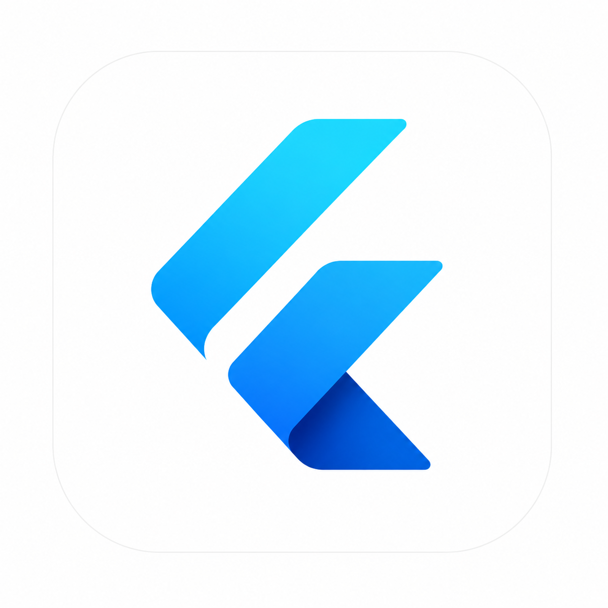
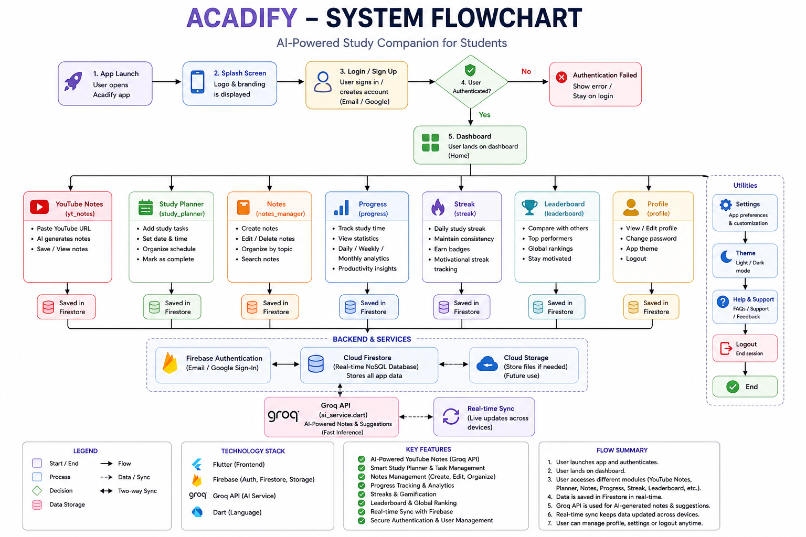
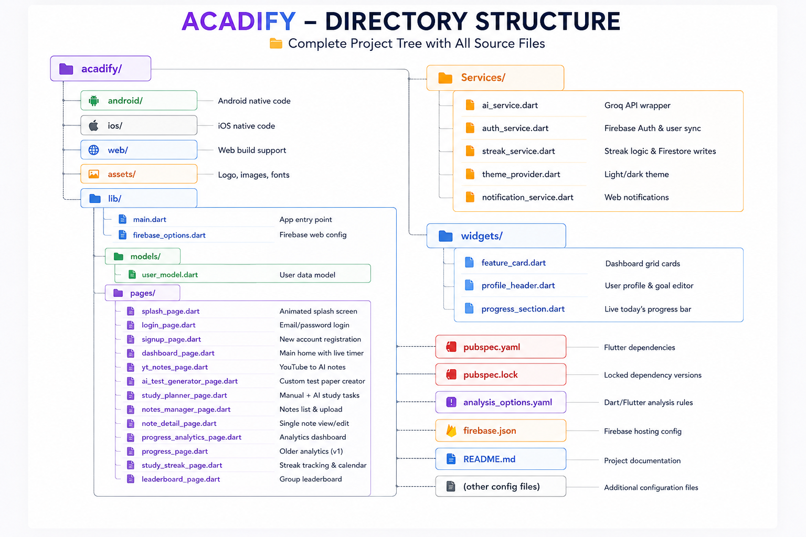

<p align="center">
  
#  Acadify – AI Powered Student Study Platform

</div>

<p align="center">
  
</p>

<p align="center">
A Flutter + Firebase + AI study companion that helps students stay organised, motivated, and exam‑ready.  
</p>

---


---

#  Project Overview

Acadify came from a simple thought – students already spend hours on YouTube, loose paper notes, and random to‑do lists. What if we could put an intelligent assistant right in their pocket, one that turns lectures into notes, builds custom tests, and actually knows what they need to study next?

That’s what we built. Acadify is a cross‑platform Flutter app with Firebase on the back and Groq AI models on the front of the intelligence layer. It can:

- Take any YouTube link and give you a full set of structured notes (summary, key points, detailed sections, terms – all organised).
- Generate a complete test paper on whatever topic you pick, with the difficulty and question style you want.
- Create a day‑by‑day study schedule from just a goal, a list of topics, and a deadline.
- Store all your notes – typed, photographed, or PDF – in one place that you can search and share.
- Track how much you actually studied each day, show you a streak to keep you going, and give you charts and stats that make progress visible.
- Let you and your friends create private groups and compete on a leaderboard (because a little healthy competition never hurts).

Everything syncs in real time across Android, iOS, and the web. We built this as our final year B.Tech project, but we hope it can genuinely help any student who picks it up.

---

#  Features

✔ **YouTube Notes** – Paste a link, get AI‑generated notes including summary, key points, detailed breakdowns, key terms, and takeaways.  
✔ **AI Test Generator** – Choose topic, class, difficulty, and question type; get a full test paper with an answer key.  
✔ **Study Planner** – Add tasks manually or let the AI design a full daily schedule that thinks about foundation first and revision later.  
✔ **Notes Manager** – Keep text, photo, and PDF notes; search across all of them, edit, share, or upload new ones to Cloudinary.  
✔ **Progress Analytics** – Clean charts showing daily and weekly study hours, task completion, notes breakdown, and a monthly calendar heatmap.  
✔ **Study Streak** – Study at least one hour a day and your streak grows automatically. Miss a day and it resets – simple but motivating.  
✔ **Leaderboard** – Create a group, share an invite code, and compete on overall score, streak length, notes count, or tasks done.  
✔ **Live Study Timer** – The dashboard runs a timer while you study; it auto‑saves in the background so your hours are never lost.

---

#  Table of Contents

- [Problem Statement](#problem-statement)
- [Why This Project](#why-this-project)
- [System Flow](#system-flow)
- [Directory Structure](#directory-structure)
- [Quick Start](#quick-start)
- [Screenshots](#screenshots)
- [Technical Details](#technical-details)
- [Developer](#developer)
- [License](#license)

---

#  Problem Statement

We noticed that most students – including us – face the same set of daily struggles:

- No quick way to turn a YouTube video into study notes you can actually revise.
- No personalised self‑testing tool that matches exactly what you’re studying.
- No automatic planner that breaks a huge syllabus into manageable chunks.
- Notes everywhere: some in photos, some in random apps, some lost forever.
- No way to see at a glance whether you’re falling behind or actually improving.
- Studying alone can feel like an isolated grind without a sense of how you compare to peers.

Acadify was built to solve exactly these problems. One app that feels like it was designed for how students actually learn, not how a generic planner thinks they should.

---

#  Why This Project

There are plenty of study apps out there, but most do one thing well and ignore the rest. We wanted to connect all the dots in a way that felt natural:

• **AI that understands education, not just chat**  
We fine-tuned our prompts so the Groq models return actual study content – not generic summaries. The test generator balances difficulty, the planner thinks about prior knowledge before moving forward, and the YouTube extractor gives you revision-ready notes, not a transcript.

• **One codebase, truly everywhere**  
Flutter let us ship on Android, iOS, and web without duplicating work. Whether you’re on your phone or laptop, the experience is the same.

• **Real-time everything**  
Firebase Firestore means your notes, tasks, and study hours update instantly across all your devices. You’ll never lose data even if you close the app mid-session.

• **Gamification that actually matters**  
Streaks and leaderboards aren’t just for show – they reflect your real work. The streak only counts when you’ve genuinely studied more than an hour, and the leaderboard uses a weighted score from tasks, notes, and consistency.

• **Clean, distraction-free design**  
We stuck with Material 3 and made sure both light and dark themes are comfortable to read for long study sessions.

---

#  System Flow

Here’s how the app works under the hood, from user tap to result:

1. **Authentication** – Sign up / log in via Firebase Auth.
2. **Dashboard** – The main hub shows your profile, daily goal, live timer, and a grid of feature cards.
3. **Feature selection** – Tap on any module (YT Notes, AI Test Generator, etc.).
4. **User input** – Provide a YouTube URL, a topic name, a goal statement, or manual task details.
5. **AI call** – The Flutter app sends a structured prompt to Groq’s API. We ask for JSON with specific fields, and we have a robust parser that fixes common AI output errors.
6. **Display & save** – Results are shown beautifully on screen, and optionally saved to Firestore (notes, tasks, test history).
7. **Real‑time sync** – Any change is immediately pushed to Cloud Firestore and visible on all devices.

For the timer, we track seconds locally and batch‑save to Firestore every minute to avoid overwhelming writes while still keeping data safe.

## System Flow

<p align="center">
  
</p>

---

## Directory Structure

<p align="center">
  
</p>

#  How to Run Locally

Follow these steps to get Acadify running on your machine.

### Prerequisites
- Flutter SDK (version 3.38 or later)
- A Firebase project with Authentication (Email/Password) and Firestore enabled
- A Groq API key (free tier is available)
- (Optional) Cloudinary account for image/PDF uploads

### Step 1 – Clone the repository
```bash
git clone https://github.com/codewithharsh08/Acadify
```
### Step 2 - Go to project directory
```bash
cd acadify
```
### Step 3 – Install dependencies
```bash
flutter pub get
```
### Step 4 – Firebase setup
```bash
Android: Place your google-services.json file in the android/app/ folder.

iOS: Place your GoogleService-Info.plist file in the ios/Runner/ folder.

Web: Open lib/firebase_options.dart and update the values to match your Firebase project’s web configuration.
```
### Step 5 – Configure Groq API key
```bash
Open: lib/Services/ai_service.dart
Replace: static const _groqKey = 'your-existing-key';
with your actual Groq API key.
```
### Step 6 – (Optional) Cloudinary configuration
```bash
Open: lib/pages/notes_manager_page.dart
Update: static const String _cloudName = 'your-cloud-name';
static const String _uploadPreset = 'your-upload-preset';
with your own Cloudinary credentials if you want to allow photo/PDF uploads.
```
### Step 7 – Run the app
```bash
flutter run
```
### Step 8 – Access via browser (web)
```bash
If running on web: flutter build web
firebase deploy --only hosting
Then open the provided hosting URL.
```

---

# Screenshots
Below are some screenshots of the app in action.

• **Dashboard (home screen)**  


• **YouTube Notes output**  


• **AI Test Generator**  


• **Study Planner (AI-generated schedule)**  


• **Notes Manager (list view)**  


• **Progress Analytics**  


• **Study Streak page**  


• **Leaderboard**  


---

## Demo Link

https://your-firebase-link.web.app

---

## Technical Details

| Component | Technology |
|----------|-----------|
| Framework | Flutter (Dart) with Material 3 |
| State Management | Provider |
| Backend | Firebase Auth, Firestore, Storage |
| AI API | Groq (llama-3.1-8b-instant, gemma2-9b-it) |
| Charts | fl_chart |
| Media Uploads | Cloudinary |
| File Picking | file_picker |
| Sharing | share_plus |
| Notifications | Browser API (dart:js_interop) |

---

## Data in Firestore

- **users** – profile, streak tracking, daily goals  
- **users/{uid}/tasks** – planner tasks  
- **users/{uid}/notes** – notes (text, image, PDF)  
- **users/{uid}/streakHistory** – daily streak records  
- **users/{uid}/studyLogs** – study hours data  
- **leaderboardGroups** – group metadata  

**AI Robustness**

We clean AI output using markdown stripping, JSON repair, and fallback parsing so users never see raw errors.

---

## Developer

**Harsh**

  LinkedIn
https://www.linkedin.com/in/harsh-singh-056b12292/
  GitHub
https://github.com/codewithharsh08

  Email
harsh983720@gmail.com

---

License

MIT License

Copyright (c) 2026 Acadify

Permission is hereby granted, free of charge, to any person obtaining a copy of this software.

THE SOFTWARE IS PROVIDED "AS IS", WITHOUT WARRANTY OF ANY KIND.

<p align="center"> Made with late-night debugging and chai. </p> ```